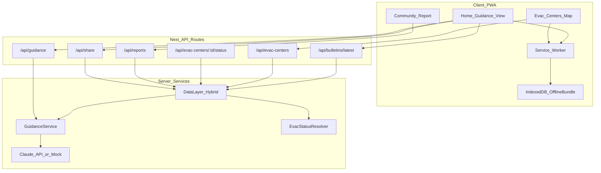
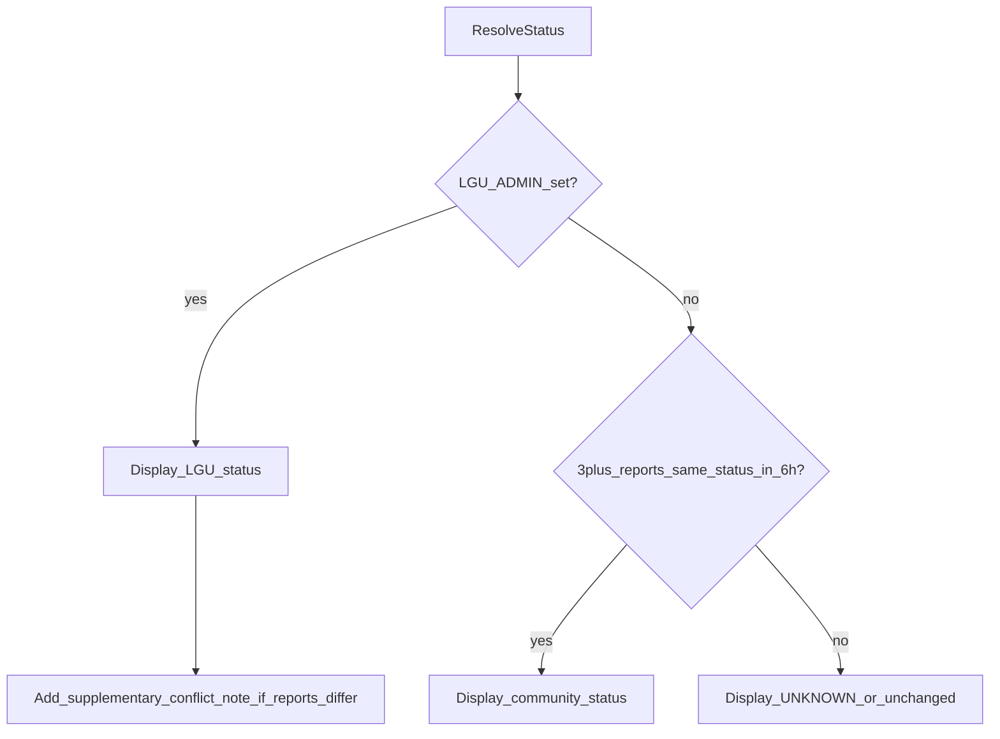

# Philippine Disaster Preparedness App — Full v1 Implementation Plan

## Current State

The [`disaster-prep`](d:\OneDrive\Training Docs\AIM_GAAI\Graded Project 4.2\disaster-prep) workspace contains **only** [`SPEC_AND_ARCHITECTURE.md`](d:\OneDrive\Training Docs\AIM_GAAI\Graded Project 4.2\disaster-prep\SPEC_AND_ARCHITECTURE.md) and [`cursorrules`](d:\OneDrive\Training Docs\AIM_GAAI\Graded Project 4.2\disaster-prep\cursorrules). No `package.json`, source code, or tests exist. A standalone PRD file is not in the repo; the spec (derived from PRD v1.0) is the authoritative requirements source.

## Target Architecture



## Phase 1 — Project Scaffold & Shared Foundation

**Initialize Next.js 14+ App Router** in `disaster-prep/` with TypeScript strict mode, Tailwind (core utilities only), ESLint, Vitest, and scripts matching [`CLAUDE.md`](d:\OneDrive\Training Docs\AIM_GAAI\Graded Project 4.2\CLAUDE.md):

```json
"scripts": {
  "dev": "next dev",
  "build": "next build",
  "lint": "next lint",
  "typecheck": "tsc --noEmit",
  "test": "vitest run"
}
```

**Folder layout** (feature-based per spec §4.5):

```
disaster-prep/
  app/                    # routes + API handlers (thin wrappers)
  features/
    guidance/             # UI, hooks, server guidance logic
    evac-centers/         # map, list, status display
    reports/              # community report form
    offline/              # SW registration, IDB, bundle sync
    shared/               # Button, Banner, ErrorState, types re-exports
  lib/
    data/                 # hybrid data layer (Supabase + local JSON)
    ai/                   # Claude client + mock fallback
    validation/           # Zod schemas (single source of truth)
    auth/                 # LGU admin token check (minimal, no user accounts)
  data/seed/              # PSGC subset, bulletins, evac centers, offline bundle
  public/                 # manifest.json, icons, sw.js
```

**Domain types & Zod schemas** — mirror §2.1 exactly in [`features/shared/types.ts`](features/shared/types.ts) and [`lib/validation/schemas.ts`](lib/validation/schemas.ts). All API handlers validate input/output at the boundary.

**Consistent API error shape** (§3.6):

```typescript
{ error: { code: string; message: string; retryable: boolean } }
```

**Environment variables** (`.env.example`):

| Variable | Purpose |
|---|---|
| `ANTHROPIC_API_KEY` | Optional; absent → mock guidance |
| `NEXT_PUBLIC_SUPABASE_URL` / `SUPABASE_SERVICE_KEY` | Optional; absent → local JSON store |
| `LGU_ADMIN_API_KEY` | Protects PATCH evac status |
| `NEXT_PUBLIC_APP_URL` | Share deep links |

---

## Phase 2 — Hybrid Data Layer

### Local fallback (always works without credentials)

- **In-memory / file-backed repository** in [`lib/data/local-store.ts`](lib/data/local-store.ts) reading seed JSON:
  - `data/seed/locations.json` — ~20–30 barangays (Metro Manila + Cebu samples) with PSGC codes
  - `data/seed/bulletins.json` — active + expired bulletins for edge-case testing
  - `data/seed/evac-centers.json` — centers with varied statuses and distances
- **Location resolver** with fuzzy name match + disambiguation suggestions (§3.1); never silent random default.

### Supabase path (when env vars set)

SQL migration in [`supabase/migrations/001_initial.sql`](supabase/migrations/001_initial.sql):

| Table | Key columns |
|---|---|
| `hazard_bulletins` | id, source, hazard_type, issued_at, valid_until, affected_areas (jsonb), severity, raw_text |
| `evacuation_centers` | id, name, barangay_code, lat, lng, capacity, status, status_updated_at, status_source |
| `community_reports` | id, type, target_evac_center_id, location (jsonb), message, reported_status, submitted_at, client_hash, needs_review |
| `guidance_cache` | optional; bulletin_id + language + phase → cached response |

[`lib/data/index.ts`](lib/data/index.ts) exports a single interface; picks Supabase or local based on env.

---

## Phase 3 — API Routes (6 endpoints)

Thin handlers in `app/api/**` delegating to feature services.

### `POST /api/guidance` — core safety path

[`features/guidance/server/guidance-service.ts`](features/guidance/server/guidance-service.ts):

1. Resolve location; return disambiguation payload if unresolved
2. Fetch **active** bulletins only (`validUntil > now`) for location
3. **No bulletin** → `isFallback: true`, generic prep content (no fabricated hazard claims)
4. **Multiple bulletins** → return array of `GuidanceResponse` ranked by severity desc (do not merge)
5. **AI path** (5s timeout via `AbortController`):
   - If `ANTHROPIC_API_KEY` set → Claude Sonnet with bulletin `rawText` + location context
   - Else → deterministic mock from bulletin severity/hazardType
6. **Validate output** — banned-content filter; reject → static fallback from offline bundle content
7. **Timeout/error** → static fallback for hazardType + severity, `isFallback: true`

### `GET /api/bulletins/latest`

Return active bulletins for `locationRef`; exclude expired.

### `GET /api/evac-centers`

Query by `{ lat, lng, radiusKm }` or `{ barangayCode }`. Implement **radius expansion** 5 → 15 → 30 km (§3.2). Apply status resolution (Phase 4) before response.

### `PATCH /api/evac-centers/:id/status`

Require `LGU_ADMIN_API_KEY` header (401/403 if missing). Set `statusSource: "LGU_ADMIN"`.

### `POST /api/reports`

- Zod validate; reject malformed with field-specific errors
- Hash `clientHash` from request (never store raw IP/device ID)
- Rate limit: 10/hour per `clientHash` (in-memory for local; DB counter for Supabase)
- Profanity heuristic → reject obvious abuse; ambiguous → `needsReview: true`
- **Do not** directly flip displayed status from a single report

### `POST /api/share`

Generate `shareText` + `shareUrl`; failures return error but must not block guidance viewing (§3.6).

---

## Phase 4 — Evacuation Center Status Resolution

[`features/evac-centers/server/status-resolver.ts`](features/evac-centers/server/status-resolver.ts) encodes §3.2 rules:



- Default missing data → `UNKNOWN`, never `OPEN`
- Stale status (>24h during active bulletin) → UI warning flag
- `reportCount` = corroborating reports in last 6h

---

## Phase 5 — Frontend Features & Pages

### App shell (`app/layout.tsx`, `app/page.tsx`)

- Language selector (tl / ceb / en) — persisted in `localStorage` only
- Location picker: barangay search with disambiguation UI
- Offline banner component (§3.4)
- Mobile-first Tailwind; meaningful content skeleton within 3s target

### Guidance view [`features/guidance/`](features/guidance/)

- Fetch bulletins + guidance; show multiple advisories when conflicting
- Visual distinction for `isFallback: true` (badge + muted styling)
- Phase tabs: NOW / NEXT_24H / DURING_IMPACT / AFTERMATH
- Share button → `/api/share` (non-blocking on failure)
- "No active advisory" empty state

### Evac centers [`features/evac-centers/`](features/evac-centers/)

- MapLibre GL map (lazy-loaded dynamic import to protect bundle budget)
- List + map markers color-coded by status
- Distance labels; expanded-radius messaging
- Status badges with stale/conflict supplementary notes

### Community reports [`features/reports/`](features/reports/)

- Form for EVAC_STATUS / ROAD_CONDITION / OTHER_HAZARD
- Client-side `clientHash` generation (session-scoped, hashed fingerprint — not device ID)
- Plain-language validation errors

### Shared UI [`features/shared/`](features/shared/)

- `OfflineBanner`, `ErrorState`, `LoadingSkeleton`, `StatusBadge`

**Bundle discipline:** dynamic import MapLibre; audit `next build` output to stay under 300KB gzipped app shell.

---

## Phase 6 — Offline PWA

[`features/offline/`](features/offline/):

1. **`public/manifest.json`** — installable PWA metadata
2. **Service Worker** (`public/sw.js` or `next-pwa` alternative kept minimal) — cache app shell + API responses
3. **IndexedDB store** — persist `OfflineBundle` (§2.3):
   - Static checklists per language
   - Hazard-specific static guidance per type/severity
   - Last-known evac center snapshot
4. **Bundle endpoint** — `GET /api/offline-bundle` (internal) or static `data/seed/offline-bundle.json` (<2MB)
5. **Connectivity hook** — `navigator.onLine` + fetch probe; auto-switch to cached content with timestamp banner
6. **First-time offline** — explicit "connect briefly to download" screen (§3.4)
7. **Staleness** — if bundle >7 days old, prompt refresh when online; still serve stale content

Register SW from `app/layout.tsx` client component.

---

## Phase 7 — AI Integration (Hybrid)

[`lib/ai/claude-client.ts`](lib/ai/claude-client.ts):

- Server-only Anthropic SDK call
- Structured prompt: bulletin text + location + language + phase; require JSON-shaped output parsed via Zod
- 5-second timeout; on failure delegate to [`lib/ai/mock-guidance.ts`](lib/ai/mock-guidance.ts)
- Banned-content post-filter before returning

**Never** import AI client from any `"use client"` module.

---

## Phase 8 — Tests (Edge-Case Priority)

Vitest unit tests colocated as `*.test.ts`:

| Area | Key cases (from §5) |
|---|---|
| Guidance | No bulletin → fallback; expired excluded; AI timeout → static; conflicting bulletins not merged |
| Evac status | LGU beats 2 community reports; no data → UNKNOWN; 3 corroborating reports flip status |
| Reports | Rate limit 11th rejected; missing `targetEvacCenterId` → field error |
| Offline | Bundle served when offline; first-time offline message |
| Language | Unsupported code → English fallback |
| Auth | Unauthenticated PATCH → 401/403 |

Run `npm run lint`, `npm run typecheck`, and `npm run test` before considering complete.

---

## Implementation Order (Build Sequence)

```mermaid
gantt
  title Build_Sequence
  dateFormat X
  axisFormat %s

  section Foundation
  Scaffold_types_validation :0, 1
  Hybrid_data_layer_seeds :1, 2

  section Backend
  API_routes_bulletins_evac :2, 4
  Guidance_service_AI_mock :3, 5
  Reports_rate_limit :4, 5
  Status_resolver :4, 5

  section Frontend
  App_shell_location_lang :5, 6
  Guidance_UI :6, 7
  Evac_map_list :6, 8
  Reports_form :7, 8

  section PWA_Tests
  Offline_SW_IDB :8, 9
  Edge_case_tests :8, 10
  Lint_typecheck_build :9, 10
```



1. Scaffold + types + Zod + seed data
2. Local data layer + location resolver
3. Bulletins + evac-centers GET APIs + status resolver
4. Guidance service (mock first, then Claude wiring)
5. Reports + share + LGU PATCH
6. Frontend pages and feature UIs
7. Offline PWA layer
8. Tests + performance pass + `.env.example` + README setup instructions

---

## Out of Scope (per PRD/cursorrules — do not build)

- User accounts / persistent profiles
- Full LGU admin dashboard (only authenticated PATCH endpoint)
- Native apps, SOS dispatch, insurance, ads
- Real-time PAGASA/PHIVOLCS scraper (use seed + `MANUAL_ADMIN` bulletins for v1)
- On-device ML inference

---

## Deliverables Checklist

- Runnable `npm run dev` with zero external credentials (local/mock mode)
- Full activation when `ANTHROPIC_API_KEY` + Supabase env vars are set
- All 6 API endpoints with Zod validation and consistent errors
- PWA with offline bundle and visible degradation states
- MapLibre evac center map with status rules enforced
- Edge-case test suite covering §5 acceptance criteria
- `.env.example` and README with setup steps
